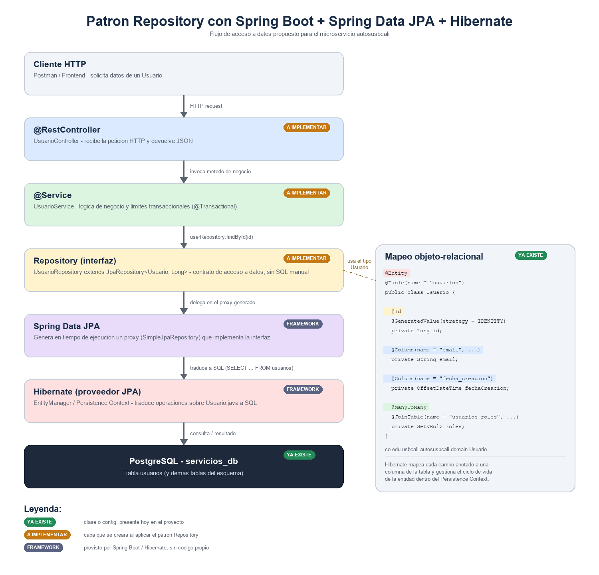

# Patrón Repository

## 1. ¿Qué es?

El **patrón Repository** es un patrón de diseño de acceso a datos: define una capa intermedia que **encapsula toda la lógica necesaria para acceder a una fuente de datos** (base de datos, API externa, archivo, etc.) y la expone al resto de la aplicación como si fuera una colección de objetos en memoria.

En vez de que la lógica de negocio construya consultas SQL, abra conexiones o conozca el esquema de tablas, simplemente le pide al repositorio lo que necesita:

```java
Usuario usuario = usuarioRepository.findByEmail("cliente@correo.com");
```

El repositorio es quien sabe **cómo** obtener ese dato; el resto del sistema solo sabe **qué** necesita.

### Problema que resuelve

Sin este patrón, el acceso a datos (SQL, `JDBC`, mapeo de `ResultSet` a objetos) queda mezclado con la lógica de negocio en controladores o servicios. Eso genera:

- Código repetido (el mismo `SELECT`/`INSERT` escrito muchas veces).
- Alto acoplamiento entre la lógica de negocio y el motor de base de datos.
- Dificultad para probar la lógica de negocio sin una base de datos real.

El Repository resuelve esto separando responsabilidades: **una interfaz por agregado del dominio**, con métodos de negocio (`findByEmail`, `findVehiculosDisponibles`, etc.) en lugar de SQL disperso por todo el código.

## 2. El patrón en este proyecto

Ver diagrama: **[`repository-pattern.png`](./repository-pattern.png)**



El diagrama muestra el flujo completo para el microservicio `autosusbcali` y distingue tres estados:

| Etiqueta | Significado |
|---|---|
| 🟢 **YA EXISTE** | Ya está en el proyecto (las entidades de `domain` y la configuración de PostgreSQL en `application.properties`). |
| 🟠 **A IMPLEMENTAR** | Capas que se crearán al aplicar el patrón (`Controller`, `Service`, `Repository`). |
| ⚪ **FRAMEWORK** | Lo provee Spring Boot / Hibernate automáticamente, sin que escribamos código. |

### 2.1 Lo que ya tenemos: las entidades (`domain`)

El proyecto ya tiene las clases JPA en `microservices/autosusbcali/src/main/java/co/edu/usbcali/autosusbcali/domain/`, generadas a partir de `database/schema.sql` (ver `generacion_pojos.md`). Estas clases son el punto de apoyo del patrón Repository: cada repositorio trabaja sobre una entidad.

Ejemplo real del proyecto, `Usuario.java`:

```java
@Entity
@Table(name = "usuarios")
@AllArgsConstructor
@NoArgsConstructor
@Data
public class Usuario {
    @Id
    @GeneratedValue(strategy = GenerationType.IDENTITY)
    private Long id;

    @Column(name = "email", length = 150, nullable = false, unique = true)
    private String email;

    @Column(name = "fecha_creacion", nullable = false)
    private OffsetDateTime fechaCreacion;

    @ManyToMany
    @JoinTable(
            name = "usuarios_roles",
            joinColumns = @JoinColumn(name = "usuario_id"),
            inverseJoinColumns = @JoinColumn(name = "rol_id"))
    private Set<Rol> roles;
}
```

`@Entity` + `@Table` le dicen a **Hibernate** (el proveedor JPA que trae `spring-boot-starter-data-jpa`) a qué tabla corresponde la clase; `@Id`, `@Column` y `@ManyToMany` mapean cada atributo a una columna o a una tabla intermedia (`usuarios_roles`).

### 2.2 Lo que se va a implementar: los repositorios

Con **Spring Data JPA** (incluido en `spring-boot-starter-data-jpa`, ver `pom.xml`), un repositorio **no se implementa a mano**: se declara como una interfaz que extiende `JpaRepository<Entidad, TipoId>`.

Estructura propuesta, paquete nuevo junto a `domain`:

```
co.edu.usbcali.autosusbcali.repository
```

Ejemplo para `Usuario`:

```java
package co.edu.usbcali.autosusbcali.repository;

import co.edu.usbcali.autosusbcali.domain.Usuario;
import org.springframework.data.jpa.repository.JpaRepository;

import java.util.List;
import java.util.Optional;

public interface UsuarioRepository extends JpaRepository<Usuario, Long> {

    Optional<Usuario> findByEmail(String email);

    Optional<Usuario> findByNumeroDocumento(String numeroDocumento);

    boolean existsByEmail(String email);

    List<Usuario> findByTipoAndActivoTrue(String tipo);
}
```

Con solo declarar esta interfaz ya se obtiene, sin escribir SQL:

- CRUD completo heredado de `JpaRepository`: `save`, `findById`, `findAll`, `deleteById`, `count`, paginación (`Pageable`) y ordenamiento (`Sort`).
- **Query methods**: Spring Data JPA parsea el nombre del método (`findByEmail`, `findByTipoAndActivoTrue`) y genera la consulta JPQL/SQL equivalente en tiempo de arranque.
- Para casos que la convención de nombres no cubre, `@Query` con JPQL o SQL nativo:

```java
@Query("select u from Usuario u join u.roles r where r.nombre = :rol")
List<Usuario> buscarPorRol(@Param("rol") String rol);
```

### 2.3 Qué pasa "por debajo" (Spring Data JPA + Hibernate)

1. **En el arranque de la aplicación**, Spring Data JPA escanea el paquete `repository`, encuentra cada interfaz que extiende `JpaRepository` y genera dinámicamente una implementación (`SimpleJpaRepository`) mediante un **proxy**. Esto lo hace `@EnableJpaRepositories`, que ya viene activado automáticamente por el *auto-configure* de `spring-boot-starter-data-jpa` al detectar el `DataSource` de PostgreSQL en `application.properties`.
2. Cuando el `Service` llama `usuarioRepository.findByEmail(...)`, en realidad invoca ese proxy.
3. El proxy delega en el `EntityManager` de **Hibernate** (el proveedor JPA por defecto de Spring Boot). Hibernate:
   - Traduce la llamada a una consulta SQL concreta para el dialecto de PostgreSQL (`SELECT ... FROM usuarios WHERE email = ?`).
   - Abre/reutiliza una conexión mediante el `DataSource` configurado (`jdbc:postgresql://localhost:5432/servicios_db`).
   - Mapea cada fila del `ResultSet` a un objeto `Usuario`, usando las anotaciones `@Column`/`@ManyToMany` de la entidad.
   - Registra esa instancia en el **Persistence Context** (caché de primer nivel), donde controla su ciclo de vida (`transient`, `managed`, `detached`, `removed`) hasta el `commit`.
4. El resultado (`Optional<Usuario>`) vuelve al `Service`, y de ahí al `Controller`.

### 2.4 Capas alrededor del repositorio (pendientes)

El repositorio no se usa directamente desde el controlador; la capa de negocio (`@Service`) es quien lo consume y define los límites transaccionales:

```java
@Service
@RequiredArgsConstructor
public class UsuarioService {

    private final UsuarioRepository usuarioRepository;

    @Transactional(readOnly = true)
    public Usuario obtenerPorEmail(String email) {
        return usuarioRepository.findByEmail(email)
                .orElseThrow(() -> new EntityNotFoundException("Usuario no encontrado"));
    }

    @Transactional
    public Usuario registrar(Usuario usuario) {
        usuario.setFechaCreacion(OffsetDateTime.now());
        return usuarioRepository.save(usuario);
    }
}
```

`@Transactional` es importante junto con Hibernate: mientras la transacción está abierta, las colecciones `@ManyToMany`/`@OneToMany` cargadas de forma perezosa (*lazy*, el valor por defecto) —como `usuario.getRoles()`— se pueden recorrer sin error; fuera de la transacción lanzaría `LazyInitializationException`.

### 2.5 Por qué conviene en este proyecto

- **Desacoplamiento**: si mañana cambia el motor de base de datos o se agregan cachés, la interfaz del repositorio no cambia.
- **Menos código repetido**: no hay que escribir DAOs con `JdbcTemplate` a mano para cada una de las ~29 entidades del dominio.
- **Testabilidad**: los `Service` se pueden probar con un `UsuarioRepository` simulado (Mockito), sin base de datos real.
- **Consistencia con el esquema**: cada repositorio trabaja sobre la entidad ya validada contra `database/schema.sql` (tipos, `nullable`, relaciones).

### 2.6 Alcance recomendado

No todas las tablas necesitan su propio repositorio expuesto: las tablas puramente intermedias de relaciones muchos-a-muchos (`roles_permisos`, `usuarios_roles`) ya se gestionan a través de las colecciones (`@ManyToMany`/`@JoinTable`) de las entidades raíz (`Usuario`, `Rol`), sin necesidad de una interfaz `JpaRepository` propia. Un repositorio por cada **entidad raíz** del dominio (`Usuario`, `Vehiculo`, `Cotizacion`, `Venta`, `Pago`, etc.) es suficiente y es el siguiente paso natural sobre las clases que ya están en `domain`.
